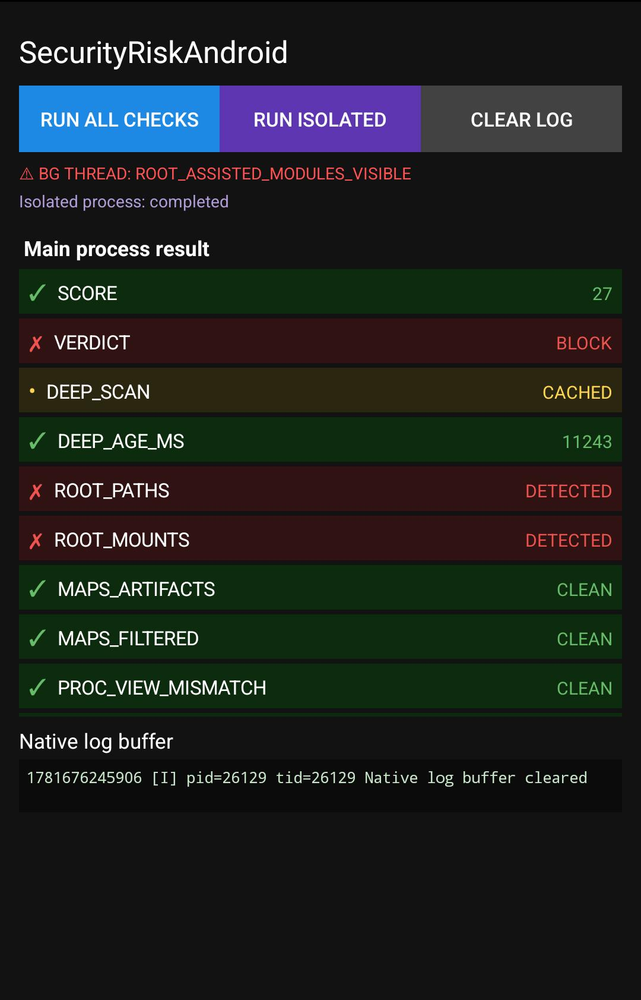

# SecurityRiskAndroid

<p align="center">
  
</p>

Android sample app for detecting suspicious runtime conditions such as root traces, hooking frameworks, Frida artifacts, debugger attachment, suspicious memory mappings, ART/Zygote side effects, package visibility manipulation, mock-location signals, suspicious disk/process/port artifacts, root-assisted diagnostic signals, isolated-process view differences, and native code tampering.

The project uses a JNI native library and exposes the result to a simple Java UI. The native checker is designed as a layered runtime-risk detector rather than a single root check. Root-assisted checks are treated as optional diagnostic evidence, not as the normal app-process view.

## File Structure

```text
app/src/main/cpp/security_checks.c
app/src/main/java/com/example/securitysample/SecurityChecker.java
app/src/main/java/com/example/securitysample/MainActivity.java
app/src/main/java/com/example/securitysample/SecurityIsolatedService.java
app/src/main/AndroidManifest.xml
```

## Current Runtime Model

The checker uses four runtime paths:

```text
FAST_SYNC
- Runs immediately when runAllChecks() is called.
- Intended to return quickly without blocking the UI for heavy scans.
- Produces an immediate score/verdict using cheap or medium-cost checks.

DEEP_ASYNC
- Runs in one native background worker thread.
- Starts with a small randomized delay to avoid fully deterministic timing.
- Performs heavier ART, package, location, PHDR, GOT/PLT, smaps, disk, process, port, and disk-vs-memory checks.
- Result fields are returned as PENDING until the deep worker finishes.
- Finished deep results are cached and reused by later runAllChecks() calls.

ROOT_ASSISTED_ASYNC
- Runs as part of the async diagnostic path when su is available/granted.
- Uses a root helper view to inspect /data/adb, module files, process lists, port/socket state, and mounts.
- Keeps root-assisted results separate from normal app-process results.
- Useful for comparing APP_VIEW versus ROOT_VIEW and detecting hiding/delta behavior.

ISOLATED_PROCESS_COMPARE
- Runs the same native checker from an isolated Android service process.
- MainActivity communicates with the isolated process using Messenger IPC.
- Isolated-process result fields are shown with an ISO_ prefix.
- Differences between main-process and isolated-process results are shown as DELTA_<FIELD>.
```

Example lifecycle:

```text
First call:
SCORE:1|VERDICT:CLEAN|DEEP_SCAN:PENDING|PACKAGE_RISK:PENDING|ROOT_ASSISTED_ASYNC:PENDING|...

After deep scan completes:
SCORE:8|VERDICT:BLOCK|DEEP_SCAN:CACHED|DEEP_AGE_MS:1234|PACKAGE_RISK:DETECTED|ROOT_ASSISTED_ASYNC:DENIED|...

After root-assisted scan is granted:
SCORE:14|VERDICT:BLOCK|ROOT_ASSISTED_ASYNC:GRANTED|ROOT_ASSISTED_MODULES:DETECTED|ROOT_VIEW_DELTA:DETECTED|...

After isolated-process comparison:
ISO_SCORE:4|ISO_VERDICT:WARNING|DELTA_PACKAGE_RISK:MAIN=DETECTED ISO=CLEAN|...
```

## Features

The native checker currently performs these checks:

```text
Root path visibility detection
Root mount visibility detection
Xposed / LSPosed / Zygisk / Magisk artifact scan
Frida artifact scan
Raw syscall /proc/self/maps scan
Raw syscall vs libc comparison for maps, mountinfo, status, fd, and task views
Maps filtering mismatch check
/proc/self/smaps consistency check
Executable Private_Dirty anomaly check from smaps
Debugger detection via TracerPid
Emulator file detection
Suspicious executable memory mapping detection
RWX memory detection
Executable deleted mapping detection
Suspicious memfd / ashmem executable mapping detection
Normal ART/JIT memfd allowlist
Thread name scan
File descriptor scan
Native symbol owner check
Expanded libc/libdl critical symbol ownership check
Inline hook heuristic check
JNI function table owner and executable-range check
JavaVM function table owner and executable-range check
GOT/PLT import pointer ownership check
PHDR loaded-module scan
PHDR vs maps executable segment comparison
Self-entry breakpoint / patch probe
Native .text live memory integrity check
Disk-vs-memory native library hash check
Kernel identity consistency check
USB debugging signal check
Bootloader / verified boot property check
Build/security property check
ART bridge class scan
ART stack trace scan
ART ClassLoader / DexPathList scan
ART dex/apk/jar/vdex/oat maps scan
Package visibility / HMA-style inconsistency probe
/data/app versus PackageManager cross-view inconsistency probe
Risky package visibility probe
Location / mock-location environment probe
System framework runtime / service-object sanity check
Namespace and fdinfo diagnostic scan
Public storage artifact scan
Root-only disk artifact scan
Magisk / KernelSU / APatch ZIP module structure scan
Risky APK artifact scan
Suspicious process scan
Suspicious listening port / unix socket scan
Root-assisted async diagnostic scan
Root view versus app view delta detection
Isolated-process comparison via Android service + Messenger
Async deep scan worker
Deep scan cached result state
Native log buffer exposed to Java
Java callback support for background detections
```

## Important Terminology

Some checks use the word `CLEAN`, but this should be interpreted carefully.

```text
ROOT_PATHS:CLEAN
ROOT_MOUNTS:CLEAN
```

means:

```text
No root artifact was visible from this app process.
```

It does **not** prove that the device is truly unrooted. Tools such as Shamiko may hide root artifacts from the target app process.

For this reason, runtime tampering checks are separated from root visibility checks:

```text
ROOT_PATHS / ROOT_MOUNTS
- Root visibility signals from this process.

MAPS_FILTERED / PROC_VIEW_MISMATCH / SMAPS_CONSISTENCY
- Multi-view /proc and memory-map consistency signals.

JNI_TABLE / JVM_TABLE / GOT_PLT / LINKER_INLINE
- Runtime pointer, symbol ownership, inline hook, and imported-callsite integrity signals.

ART_BRIDGE_CLASSES / ART_STACK / ART_CLASSLOADER / ART_DEX_MAPS
- ART/Zygote/runtime side-effect signals.

PACKAGE_RISK / PACKAGE_INCONSISTENCY / DATA_APP_INCONSISTENCY
- Package visibility, HMA-style hiding, and /data/app cross-view signals.

LOCATION_ENVIRONMENT
- Mock location and location-provider environment signals.

FRAMEWORK_RUNTIME
- System framework mapping, framework classloader, and framework service-object sanity signals.

NAMESPACE_FDINFO
- Namespace and fd/fdinfo diagnostic signals.

DISK_PUBLIC_ARTIFACTS / DISK_ROOT_ARTIFACTS / DISK_ZIP_MODULES / DISK_APK_RISK
- Disk artifact signals from public storage, root-only paths, Magisk-style ZIP modules, and risky APK names.

SUSPICIOUS_PROCESS / SUSPICIOUS_PORTS
- Process, TCP listener, and unix socket signals such as Frida, debug servers, sshd/dropbear, Termux SSH, or root daemons.

ROOT_ASSISTED_ASYNC / ROOT_VIEW_DELTA
- Optional root-assisted diagnostic signals. ROOT_VIEW_DELTA:DETECTED means the normal app view looked clean, but the root helper view found evidence.

ISO_* / DELTA_*
- Isolated-process comparison signals shown by MainActivity. ISO_* is the isolated service result; DELTA_* means the main process and isolated process disagree.

MEMORY_LIVE / MEMORY_DISK
- Native library integrity signals.
```

## Requirements

Recommended environment:

```text
Android Studio / Gradle project
Android Gradle Plugin 8.x
Gradle 8.x
NDK 25.x or newer
CMake 3.22.1 or newer
minSdk 26 or compatible
```

## AndroidManifest Setup

The normal launcher activity stays the same. To enable isolated-process comparison, add this service inside the `<application>` block:

```xml
<service
    android:name=".SecurityIsolatedService"
    android:process=":security_isolated"
    android:isolatedProcess="true"
    android:exported="false"
    android:stopWithTask="true" />
```

Notes:

```text
android:isolatedProcess="true"
- Runs the service under an isolated UID.
- Produces a separate runtime/process view.
- Useful for comparing main-process and isolated-process behavior.

android:exported="false"
- Keeps the service private to this app.

android:process=":security_isolated"
- Gives the isolated service its own process name.
```

## CMake Setup

Make sure the native library links against `log` and `dl`.

Example `CMakeLists.txt`:

```cmake
cmake_minimum_required(VERSION 3.22.1)

project(securitysample)

add_library(
    securitysample
    SHARED
    security_checks.c
)

find_library(log-lib log)

target_link_libraries(
    securitysample
    ${log-lib}
    dl
)
```

## Java Native API

`SecurityChecker.java` loads the native library and exposes these methods:

```java
public native String runAllChecks();
public native void setCallback(ThreatCallback callback);
public native String getNativeLog();
public native void clearNativeLog();
```

High-level helper methods:

```java
Map<String, String> getParsedResults();
boolean isCompromised();
```

## Java UI and Isolated Service

The Java side now has two runtime views:

```text
MainActivity
- Runs normal app-process checks.
- Displays native result rows.
- Displays native log buffer.
- Binds to SecurityIsolatedService using Messenger.
- Shows isolated service result rows using ISO_ prefixes.
- Shows main-vs-isolated disagreement using DELTA_ rows.

SecurityIsolatedService
- Runs in :security_isolated.
- Uses Messenger IPC instead of a local Binder cast.
- Calls SecurityChecker inside the isolated process.
- Optionally waits briefly so DEEP_ASYNC can finish before returning a final isolated result.
```

Do not use the normal `LocalBinder` pattern for this service. Because the service runs in a separate process, use:

```text
Messenger
AIDL
or raw Binder IPC
```

The current sample uses `Messenger` because it is simple and does not require AIDL files.

## Usage

In `MainActivity.java`:

```java
checker = new SecurityChecker();

checker.setThreatCallback(reason -> {
    mainHandler.post(() -> {
        updateBgStatus("⚠ BG THREAD: " + reason);
        refreshNativeLog();
    });
});
```

The app UI displays:

```text
Security check result rows
Compromised / clean summary
Background threat status
Full native log buffer
Isolated service status
ISO_ isolated-process result rows
DELTA_ main-vs-isolated comparison rows
```

## Result Fields

Common native result fields:

```text
SCORE
VERDICT
DEEP_SCAN
DEEP_AGE_MS
ROOT_PATHS
ROOT_MOUNTS
MAPS_ARTIFACTS
MAPS_FILTERED
PROC_VIEW_MISMATCH
SMAPS_CONSISTENCY
SUSPICIOUS_MAPS
DEBUGGER
THREADS
FDS
LINKER_INLINE
GOT_PLT
USB_DEBUGGING
BOOTLOADER_UNLOCKED
BUILD_PROPS
KERNEL_IDENTITY
JNI_TABLE
JVM_TABLE
MODULES
SELF_BREAKPOINTS
ART_BRIDGE_CLASSES
ART_STACK
ART_CLASSLOADER
ART_DEX_MAPS
PACKAGE_RISK
PACKAGE_INCONSISTENCY
DATA_APP_INCONSISTENCY
LOCATION_ENVIRONMENT
FRAMEWORK_RUNTIME
NAMESPACE_FDINFO
DISK_PUBLIC_ARTIFACTS
DISK_ROOT_ARTIFACTS
DISK_ZIP_MODULES
DISK_APK_RISK
SUSPICIOUS_PROCESS
SUSPICIOUS_PORTS
ROOT_ASSISTED_ASYNC
ROOT_ASSISTED_ROOT_VIEW
ROOT_ASSISTED_MODULES
ROOT_ASSISTED_PROCESS
ROOT_ASSISTED_PORTS
ROOT_VIEW_DELTA
EMULATOR
MEMORY_LIVE
MEMORY_DISK
```

Java UI comparison fields:

```text
ISO_<FIELD>
DELTA_<FIELD>
```

Possible status values include:

```text
CLEAN
DETECTED
HOOKED
TAMPERED
MISMATCH
PENDING
CACHED
RUNNING_CACHED
GRANTED
DENIED
TIMEOUT
UNAVAILABLE
NOT_RUN
SKIPPED
ERROR
```

## Example Output

Initial fast result while deep scan is still running:

```text
SCORE:1|VERDICT:CLEAN|DEEP_SCAN:PENDING|MAPS_FILTERED:PENDING|GOT_PLT:PENDING|SMAPS_CONSISTENCY:PENDING|PACKAGE_RISK:PENDING|ROOT_ASSISTED_ASYNC:PENDING|
```

Cached deep result:

```text
SCORE:8|VERDICT:BLOCK|DEEP_SCAN:CACHED|DEEP_AGE_MS:1234|PACKAGE_RISK:DETECTED|FRAMEWORK_RUNTIME:CLEAN|GOT_PLT:CLEAN|SMAPS_CONSISTENCY:CLEAN|
```

Root-assisted result:

```text
ROOT_ASSISTED_ASYNC:GRANTED|ROOT_ASSISTED_MODULES:DETECTED|ROOT_ASSISTED_PROCESS:DETECTED|ROOT_VIEW_DELTA:DETECTED|
```

Isolated process comparison result shown by the Java UI:

```text
ISO_SCORE:4
ISO_VERDICT:WARNING
ISO_PACKAGE_RISK:CLEAN
DELTA_PACKAGE_RISK:MAIN=DETECTED ISO=CLEAN
```

Native log output example:

```text
[I] runFastChecksInternal begin
[I] Deep async scan randomized startup delay: 421 ms
[I] GOT/PLT ownership scan summary: found_self=1 checked=8 suspicious=0
[I] SMAPS consistency summary: maps_lines=2175 smaps_headers=2175 exec_dirty_hits=0 suspicious=0
[I] Root-assisted su granted
[I] ROOT_VIEW_DELTA=DETECTED
```

## Runtime Cost

Expected runtime depends on device speed, number of loaded libraries, number of installed packages, number of framework mappings, number of file descriptors, public storage size, process visibility, port/socket visibility, and whether hooking/hiding frameworks are filtering API results. Root-assisted scans can also wait for a superuser prompt, denial, or timeout.

Approximate timing:

```text
JNI_OnLoad baseline:
1–20 ms

FAST_SYNC runAllChecks():
Target under 100–200 ms on typical devices
May be higher on old or heavily hooked devices

DEEP_ASYNC worker:
Starts after a randomized sub-1s delay
Usually hundreds of ms to a few seconds
Can be slower when PackageManager, LocationManager, ART reflection, disk scans, process scans, port scans, or /proc scans are hooked or heavily filtered

ROOT_ASSISTED_ASYNC:
May return quickly if su is unavailable or denied
May take several seconds if a root manager prompt is shown or the request times out

ISOLATED_PROCESS_COMPARE:
Requires service bind + IPC round trip
Can be slower if waiting for isolated DEEP_ASYNC to finish
```

Recommended production pattern:

```text
Startup:
- initialize JNI
- run fast checks only
- return PENDING for heavy fields

After UI is visible:
- allow deep async worker to finish
- update UI, log, or internal risk state

Before sensitive action:
- reuse cached deep result if fresh
- rerun selected deep checks if stale
- optionally compare isolated-process view
- treat root-assisted data as diagnostic evidence, especially when APP_VIEW and ROOT_VIEW disagree

Background:
- periodically or randomly run selected checks
- avoid full heavy scans on every frame or click
```

Avoid doing heavy full scans on the first rendered frame.

## Risk Score

The checker uses a score-based approach instead of relying on one signal.

Example:

```text
score >= 8  → BLOCK
score >= 4  → WARNING
score < 4   → CLEAN
```

This reduces false positives compared to immediately blocking on a single suspicious artifact.

The project treats signals with different strengths:

```text
Strong signals:
- Memory hash mismatch
- JNI / JavaVM table pointer outside trusted runtime mapping
- GOT/PLT import pointer owner mismatch
- Frida/Gum thread, fd, process, or port artifact
- Suspicious foreign executable memfd
- Foreign module dex/apk loaded into app runtime
- Package visibility inconsistency
- /data/app versus PackageManager inconsistency
- Root-assisted module/root artifact visibility
- Root view delta between app process view and root helper view

Medium signals:
- Suspicious maps artifact
- PHDR/maps mismatch
- smaps/maps consistency anomaly
- Executable Private_Dirty anomaly
- ART stack or classloader anomaly
- Framework runtime anomaly
- Location/mock environment anomaly
- SSH/dropbear/Termux SSH process or listener
- Magisk-style ZIP module or risky APK artifact
- Isolated-process delta when combined with other signals

Weak signals:
- USB debugging enabled
- Developer options indicator
- Emulator-like file presence
- Some build property anomalies
- Namespace/fdinfo diagnostic anomaly by itself
- Termux process without sshd/dropbear or other stronger companion signals
```

## Important Security Notes

This project is useful as a proof of concept and as part of a layered defense strategy.

It should not be treated as impossible to bypass.

Advanced attackers may still bypass detection by:

```text
Renaming artifacts
Filtering /proc output
Hooking native functions
Patching JNI return values
Patching GOT/PLT entries after checks complete
Patching the app binary
Running the app inside a controlled environment
Disabling background threads
Modifying the checker logic
Hooking PackageManager / LocationManager / Settings APIs
Returning fake clean values from Java/ART calls
Patching the risk score or verdict generation
Denying, delaying, or faking root-assisted diagnostic output
Making main and isolated process views consistently fake-clean
```

For stronger protection, combine this with:

```text
Server-side validation
Play Integrity API
Hardware-backed attestation when available
Certificate pinning
Native-side sensitive logic
Obfuscation
Anti-tamper checks
Runtime challenge-response
Short-lived server nonce
Multiple independent detection paths
Delayed or randomized enforcement
Main-process plus isolated-process comparison
Root-assisted diagnostics in research builds
```

Do not rely only on the Java return value from `runAllChecks()`, because Java methods can be hooked. Also do not treat `SU_DENIED` as proof that the device is clean; it only means the root-assisted diagnostic path was not granted.

For hardened builds:

```text
Set VERBOSE=0
Strip native symbols
Hide symbol visibility
Avoid exposing exact detection reasons
Avoid storing sensitive secrets in JNI
Avoid making one final return string the only enforcement point
Use server-side challenge-response for important decisions
Keep root-assisted checks opt-in or diagnostic in research builds
Treat isolated-process delta as supporting evidence, not absolute proof
```

## Disclaimer

This project is for defensive testing, learning, and application hardening.

It is not a complete anti-tamper or anti-hooking solution. Use it as one layer inside a broader security design.
