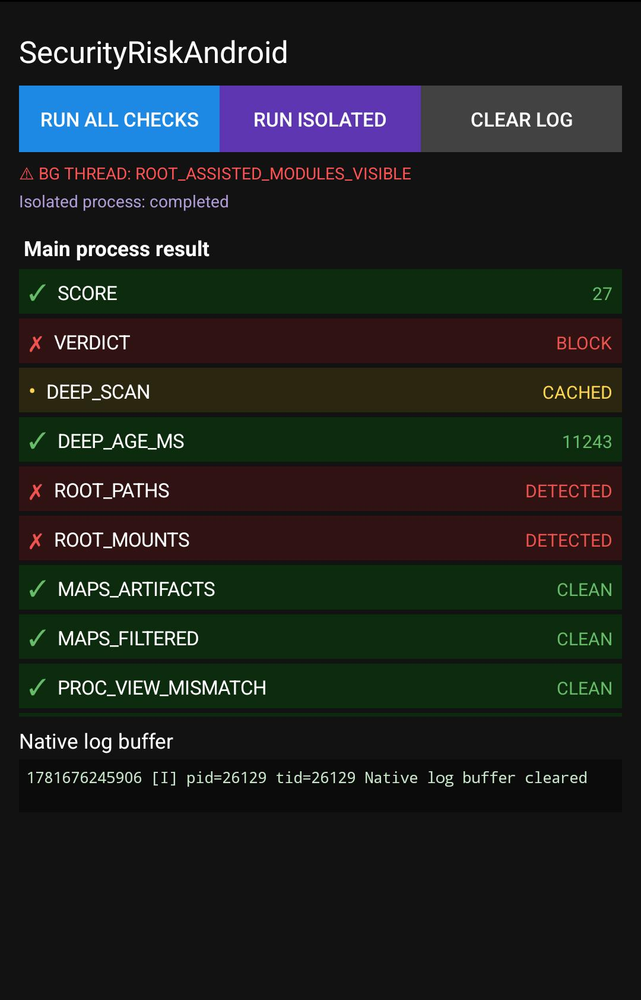

# SecurityRiskAndroid

<p align="center">
  
</p>

SecurityRiskAndroid is an Android/JNI research sample for detecting suspicious runtime conditions. It combines environment inspection, runtime integrity checks, process-view comparisons, and optional privileged diagnostics instead of relying on a single artifact or API.

> This is a defensive research tool, not proof that a device is clean or an anti-tamper system that cannot be bypassed.

## What it checks

- **Root and system modification:** root paths, mounts, modules, modified properties, boot state, and implementation-specific signals from tools such as Magisk, KernelSU, APatch, and Zygisk.
- **Runtime integrity:** native code integrity, JNI/JavaVM tables, GOT/PLT ownership, inline hooks, loaded modules, suspicious executable mappings, and debugger state.
- **Hooking frameworks:** Frida, Magisk, Zygisk, Xposed/LSPosed, suspicious threads, file descriptors, processes, ports, and ART side effects.
- **Inconsistent views:** raw syscalls versus libc, `/proc` and package visibility, SELinux views, main versus isolated process results, and app versus root-assisted results.
- **Device posture:** verified boot properties, USB debugging, emulator signals, mock-location environment, and risky disk artifacts.

The implementation intentionally treats most findings as signals to combine, not standalone proof.

## Runtime model

| Path | Purpose |
| --- | --- |
| Fast synchronous | Runs cheaper checks immediately and returns the current score and verdict. |
| Deep asynchronous | Runs heavier memory, ART, package, disk, process, and socket checks; results are cached. |
| Root-assisted | Optionally uses `su` for a diagnostic view of protected paths, modules, processes, mounts, and sockets. |
| Isolated process | Repeats checks in an isolated service and exposes disagreements using `ISO_` and `DELTA_` fields. |
| App zygote | Performs controlled SELinux policy queries before the isolated service is forked and transports the inherited result. |

Heavy fields initially return `PENDING`. A later call reuses the completed deep result as `CACHED` or `RUNNING_CACHED`.

## Detection layers

The checker groups related signals so one weak artifact does not decide the result:

| Layer | Examples |
| --- | --- |
| Environment | Root paths, mounts, modules, properties, verified boot, emulator, and debugging state. |
| Native runtime | Code hashes, executable mappings, JNI/JavaVM tables, GOT/PLT pointers, symbols, and inline patches. |
| ART and framework | Loaded classes, stack traces, class loaders, dex mappings, and framework object sanity. |
| Cross-view consistency | Raw syscall versus libc, package manager versus `/data/app`, maps versus smaps, and main versus isolated process. |
| SELinux | Process/thread contexts, enforcement/status views, and controlled app-zygote policy queries. |
| External artifacts | Files, packages, processes, sockets, ports, and optional root-assisted evidence. |

Unavailable or uniformly denied views are treated as inconclusive rather than suspicious by themselves. Specialized probes for particular root implementations remain supporting signals within these layers.

## Understanding results

Results are pipe-delimited key/value pairs:

```text
SCORE:5|VERDICT:WARNING|DEEP_SCAN:CACHED|MEMORY_LIVE:CLEAN|PACKAGE_INCONSISTENCY:DETECTED|...
```

The most common states are:

| State | Meaning |
| --- | --- |
| `CLEAN` | No evidence was visible through that probe. It does not prove absence. |
| `DETECTED`, `HOOKED`, `TAMPERED`, `MISMATCH` | The probe found suspicious evidence. |
| `PENDING`, `CACHED`, `RUNNING_CACHED` | State of the asynchronous scan. |
| `INCONCLUSIVE`, `UNAVAILABLE`, `DENIED`, `TIMEOUT`, `UNSUPPORTED` | The probe could not produce a reliable yes/no answer. |

Native score thresholds are:

```text
score >= 8  -> BLOCK
score >= 4  -> WARNING
score < 4   -> CLEAN
```

The isolated service preserves the native score for ordinary results. A confirmed app-zygote policy finding raises the effective isolated score to at least the `BLOCK` threshold and updates `VERDICT`, so consumers can use the same decision field consistently. Inconclusive or unsupported oracle results remain score-neutral.

Prefix conventions:

- `ISO_<FIELD>` is the result from the isolated service.
- `DELTA_<FIELD>` means the main and isolated process views disagree.
- `ROOT_ASSISTED_*` describes the optional privileged diagnostic path.
- `ROOT_VIEW_DELTA:DETECTED` means the privileged view found evidence hidden from the ordinary app view.

## Build and run

Requirements:

- Android Studio or Gradle 8.x
- Android SDK 35; target SDK 34; minimum SDK 26
- Android NDK 25 or newer
- CMake 3.22.1 or newer
- JDK 17

Build from Android Studio or with an installed Gradle:

```bash
gradle :app:assembleDebug
```

The APK is written under `app/build/outputs/apk/debug/`.

The app starts a fast scan immediately, launches the deep worker, binds the isolated service, and refreshes the UI when results arrive. Root-assisted checks may show a superuser prompt when `su` is visible to the app.

## Java API

`SecurityChecker` exposes the native result, parsed results, log buffer, and a background detection callback:

```java
SecurityChecker checker = new SecurityChecker();

checker.setThreatCallback(reason ->
        mainHandler.post(() -> updateBgStatus(reason)));

Map<String, String> results = checker.getParsedResults();
boolean compromised = checker.isCompromised();
String nativeLog = checker.getNativeLog();
```

The isolated service uses `Messenger` IPC because it runs in a separate process. A normal local-binder cast is not valid across that boundary.

## Project layout

```text
app/src/main/cpp/security_checks.c
    Native probes, scoring, async scans, and result serialization.

app/src/main/java/com/example/securitysample/SecurityChecker.java
    JNI wrapper and result parser.

app/src/main/java/com/example/securitysample/SecurityAppZygote.java
    Controlled SELinux policy checks used by the isolated path.

app/src/main/java/com/example/securitysample/SecurityIsolatedService.java
    Isolated execution and app-zygote result transport.

app/src/main/java/com/example/securitysample/MainActivity.java
    Demo UI and main/isolated comparison.
```

## Limitations

- Artifact checks can be defeated by renaming, namespace isolation, filtered APIs, or kernel-side hiding.
- Java and native return values can be hooked or patched.
- Main and isolated processes can both receive consistently fabricated views.
- Root denial or an invisible `su` binary does not mean the device is unrooted.
- Seccomp-blocked system calls are unavailable probes, not negative evidence.
- OEM policies and custom ROMs can create false positives, so enforcement should combine independent signals.

For production systems, combine local signals with server-side validation, Play Integrity or hardware-backed attestation where appropriate, short-lived challenges, and careful false-positive handling. Avoid storing secrets or making irreversible decisions solely from one local result string.

## License and use

This project is intended for defensive testing, learning, and application hardening. Review the implementation and calibrate its scoring for your own threat model before using it in a real application.
